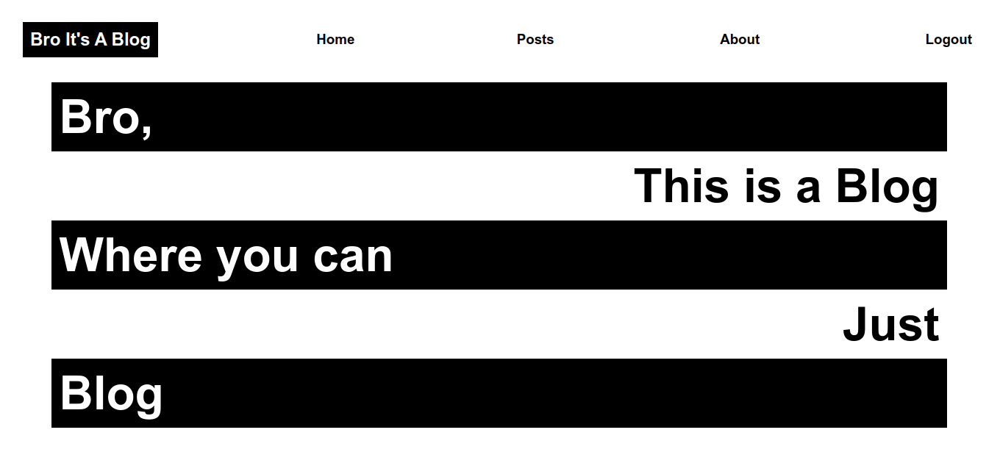

# BRO IT'S A BLOG
#### [Link for website]() [Link temporarily unavailable, will resolve in future, (heroku issue)]  

## API Routes
#### [Link for API]() [Link temporarily unavailable, will resolve in future (heroku issue)]   
`/users`  GET, POST  
`/posts`   GET  
`/posts/create-a-post`  POST  
`/posts/delete-post`  DELETE  
`/login`  POST  
`/logout`  DELETE  
`/token`  POST  

## About
This is an enthusiastic learning project by karthikeya (yeah me), a basic blog with minimal features. Goal was to keep things minimal. What you can do here? well its just upto basic blogging. Technically it is a micro blogging kinda shit cause you can't do articles and stuff (like with images, styling etc.., you get it right.). Just write whatever you can want cause none of this shit is going to saved or stored some where (no database bro). Thats right, every thing is only saved until you are using it. You might be thinking this is weird but yeah this a enthusiastic learning project for me as I said earlier (reminding you respectfully). The whole holy cause is to practically apply whatever I learned so far as much as effectively I can.  

## Stack I used:
### Express
Express.js, or simply Express, is a back end web application framework for building RESTful APIs with Node.js, released as free and open-source software under the MIT License. It is designed for building web applications and APIs. It has been called the de facto standard server framework for Node.js. (info source: well offcourse wikipedia)

### React
React is a free and open-source front-end JavaScript library for building user interfaces based on UI components. It is maintained by Meta and a community of individual developers and companies. (info source: no change wikipedia)

### Node
Node.js is an open-source, cross-platform, back-end JavaScript runtime environment that runs on a JavaScript Engine and executes JavaScript code outside a web browser, which was designed to build scalable network applications. (info source: still wikipedia)
